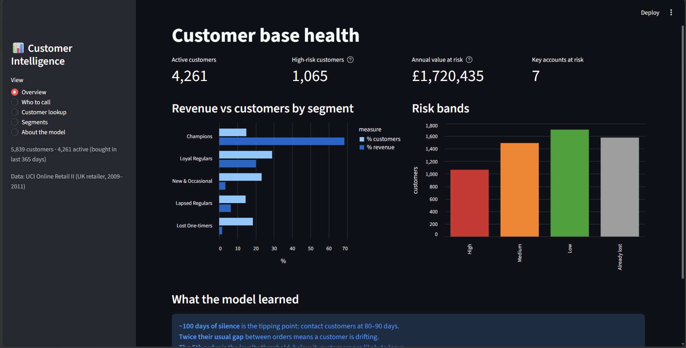
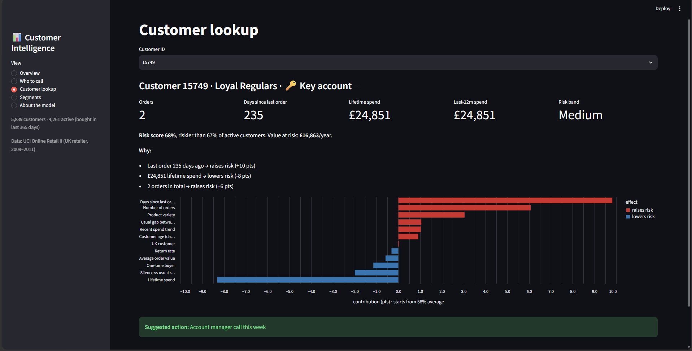

# Customer Intelligence System

A retention tool for an online retailer: it segments customers, predicts who is likely to stop buying in the next 90 days, explains each prediction, and turns the results into a prioritised call list in a Streamlit dashboard.

Built on two years of real transaction data (UCI Online Retail II, a UK online retailer, Dec 2009 – Dec 2011).



## Results

| | |
|---|---|
| Data | 770,350 clean purchases · 5,839 customers · 36,324 orders |
| Churn model | Random Forest, **ROC-AUC 0.763** vs 0.707 for a "no purchase in 60 days" rule |
| Ranking | Riskiest 10% of customers churned at **78%**, safest 10% at **6%** |
| Segments | Champions are 15% of customers and **69% of revenue** |
| Key accounts | 31 unusual high-value customers (DBSCAN), 1% of customers, ~20% of revenue |

**Business rules found with SHAP**
- Risk jumps after **~100 days** of silence → contact customers at 80–90 days.
- A customer silent for **2× their usual gap** between orders is drifting.
- The **5th order** is the loyalty threshold; below it, customers are likely to leave.

## Approach

**1. Cleaning** (`01_cleaning`): removed guest checkouts, duplicates and non-product codes (postage, fees, adjustments). Cancellations were **matched to their original purchase and removed together**; deleting only the cancellation rows leaves the original orders in and creates fake top spenders.

**2. Customer profiles** (`02_features`, `src/features.py`): one row per customer "as of" a snapshot date: recency, frequency, monetary, tenure, average gap between orders, overdue ratio (silence relative to the customer's own rhythm), spend trend, product variety and return rate.

**3. Segmentation** (`03_segmentation`): classic RFM scoring as a baseline, then K-Means (k=5) on recency, log(frequency) and log(monetary). K-Means silhouette 0.365 vs 0.058 for the rule-based segments. DBSCAN flags unusual customers; combined with top-5% spend, these become key accounts.

| Segment | Customers | Revenue |
|---|---|---|
| Champions | 15% | 69% |
| Loyal Regulars | 29% | 20% |
| Lapsed Regulars | 15% | 6% |
| New & Occasional | 23% | 3% |
| Lost One-timers | 18% | 2% |

**4. Churn model** (`04_churn_model`, `src/churn.py`): churn = no purchase in the next 90 days. Five **time-based snapshots**, 90 days apart: features use only data before each cutoff, labels come from the 90 days after. Trained on four cutoffs, tuned on the latest of them, tested once on the final cutoff. Only customers active in the prior year are scored.

| Model | ROC-AUC | PR-AUC |
|---|---|---|
| Rule: recency > 60 days | 0.707 | 0.658 |
| Logistic Regression | 0.759 | 0.706 |
| XGBoost | 0.759 | 0.709 |
| **Random Forest** | **0.763** | **0.721** |

**5. Explanations** (`05_explain`, `src/explain.py`): SHAP values per customer, converted into plain-English reasons, e.g. *"Last order 211 days ago → raises risk (+10 pts)"*.

**6. Dashboard** (`app/app.py`): overview, "who to call" list (High-risk band first, then sorted by annual value at risk, CSV export), customer lookup with reasons and a suggested action, segment profiles, and model notes.



## Limitations

- **Seasonality:** churn is 15–20 points lower in windows covering the pre-Christmas rush. A seasonal feature improved calibration on the test set, but with only one earlier holiday season it could not be validated without using the test data, so it was left out. Risk bands are therefore **rank-based** (top 25% = High) rather than relying on raw probabilities.
- **Segments vs risk:** K-Means labels some high-spend but inactive customers as Champions, which is why the separate risk score is needed.
- **Partial returns** are not netted against their original orders, which slightly inflates some spend.
- **No campaign data:** suggested actions are rules, not measured effects. The next step would be an A/B test with a holdout group.

## Project structure

```
customer-intelligence/
├── app/app.py                 Streamlit dashboard
├── notebooks/
│   ├── 01_cleaning.ipynb
│   ├── 02_features.ipynb
│   ├── 03_segmentation.ipynb
│   ├── 04_churn_model.ipynb
│   └── 05_explain.ipynb
├── src/
│   ├── features.py            customer profiles as of a snapshot date
│   ├── segmentation.py        RFM scoring + K-Means input matrix
│   ├── churn.py               time-based churn labels
│   └── explain.py             SHAP values → plain-English reasons
├── data/                      (not in repo: raw/ and processed/)
├── models/                    (not in repo: generated by the notebooks)
└── requirements.txt
```

## How to run

```bash
python -m venv .venv
.venv\Scripts\activate          # macOS/Linux: source .venv/bin/activate
pip install -r requirements.txt
```

1. Download [Online Retail II](https://archive.ics.uci.edu/dataset/502/online+retail+ii) and place `online_retail_II.xlsx` in `data/raw/`.
2. Run the notebooks in order (`01` → `05`). They create `data/processed/` and `models/`.
3. Start the dashboard from the project root:
   ```bash
   streamlit run app/app.py
   ```
4. Notebooks render more reliably on [nbviewer](https://nbviewer.org/github/Shashank05-87/customer-intelligence/tree/main/notebooks/).
**Stack:** Python · pandas · scikit-learn · XGBoost · SHAP · Streamlit · Altair

Data: Chen, D. (2012). Online Retail II [Dataset]. UCI Machine Learning Repository. CC BY 4.0.
